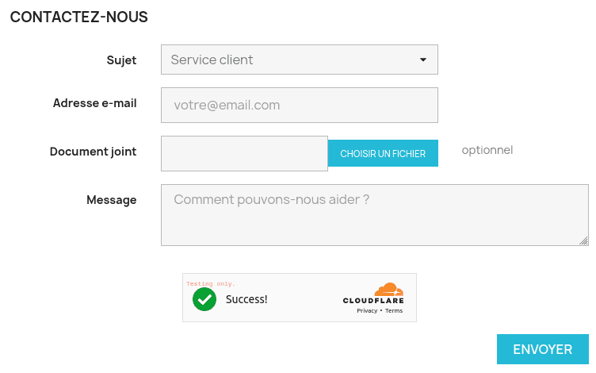

# Prestashop Cloudflare Turnstile

[](https://php.net/)
[](https://www.prestashop.com)
[](https://github.com/Pixel-Open/prestashop-cloudflare-turnstile/releases)

## Presentation

[Turnstile](https://developers.cloudflare.com/turnstile/) is Cloudflare's smart CAPTCHA alternative. The module allows Turnstile to protect your Prestashop forms:

- Contact
- Login
- Register
- Reset password
- Custom or third-party forms



## Requirements

- Prestashop >= 1.7.6.0
- PHP >= 7.2.0

## Installation

Download the **pixel_cloudflare_turnstile.zip** file from the [last release](https://github.com/Pixel-Open/prestashop-cloudflare-turnstile/releases/latest) assets.

### Admin

Go to the admin module catalog section and click **Upload a module**. Select the downloaded zip file.

### Manually

Move the downloaded file in the Prestashop **modules** directory and unzip the archive. Go to the admin module catalog section and search for "Cloudflare Turnstile".

## Configuration

- **Sitekey**: the sitekey given for the site in your Cloudflare dashboard
- **Secret key**: the secret key given for the site in your Cloudflare dashboard
- **Theme**: the Turnstile theme (auto, light or dark)
- **Forms to validate**: the forms where a Turnstile validation is required

For the registration form, the widget is automatically added with a hook. For "contact", "login" and "reset password" forms, **you need to manually add the widget in the template files**, usually before the validation button.

**Never select a form to validate without the widget in the form template.**

### Widget

```html
{widget name='pixel_cloudflare_turnstile'}
```

Override the default configured theme by adding a theme option (auto, light or dark):

```html
{widget name='pixel_cloudflare_turnstile' theme='dark'}
```

Override the default action name by adding an action option:

```html
{widget name='pixel_cloudflare_turnstile' action='my-form'}
```

### Forms

| Form           | Template                                                                      |
|----------------|-------------------------------------------------------------------------------|
| Contact        | themes/{themeName}/modules/contactform/views/templates/widget/contactform.tpl |
| Login          | themes/{themeName}/templates/customer/_partials/login-form.tpl                |
| Reset password | themes/{themeName}/templates/customer/password-email.tpl                      |

### Protect a custom or third-party form

1. Add the Cloudflare Turnstile widget in the Smarty form template:

```html
{widget name='pixel_cloudflare_turnstile' action='custom-form'}
```

2. In a module, add a new hook to call Turnstile validation on form post:

```php
public function install(): bool
{
    return parent::install() &&
        $this->registerHook('actionFrontControllerInitBefore');
}

public function hookActionFrontControllerInitBefore(array $params): void
{
    $controllerClass = get_class($params['controller']);

    if ($controllerClass === 'MyFormController' && Tools::isSubmit('myForm')) {
        Pixel_cloudflare_turnstile::turnstileValidation();
    }
}
```

If the validation fails, the customer is redirected to the previous page with an error message.

### Testing

Use the following sitekeys and secret keys for testing purposes:

**Sitekey**

| Sitekey                  | Description                     |
|--------------------------|---------------------------------|
| 1x00000000000000000000AA | Always passes                   |
| 2x00000000000000000000AB | Always blocks                   |
| 3x00000000000000000000FF | Forces an interactive challenge |

**Secret key**

| Secret key                          | Description                          |
|-------------------------------------|--------------------------------------|
| 1x0000000000000000000000000000000AA | Always passes                        |
| 2x0000000000000000000000000000000AA | Always fails                         |
| 3x0000000000000000000000000000000AA | Yields a "token already spent" error |